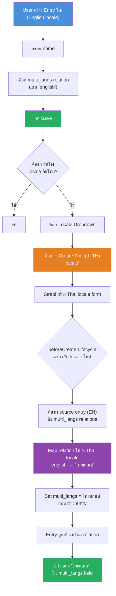
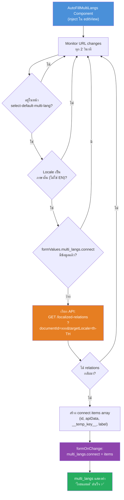
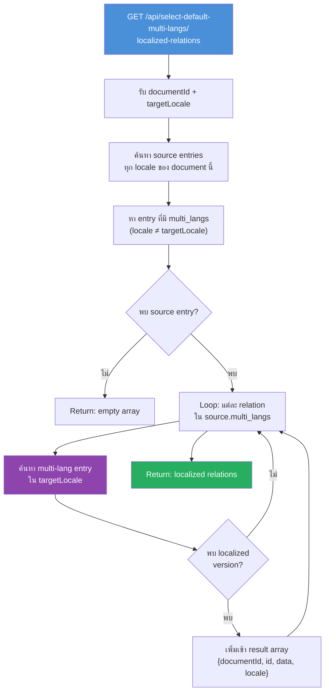

# Flow: เพิ่ม Entry ใน select_default_multi_lang (Multi-Language)

## Overview Flow

## Detailed: Frontend AutoFill Flow (via Form API)

> **หมายเหตุ:** ใช้ Strapi's internal `useForm` hook + `formOnChange()` เพื่อ set ค่า relation โดยตรง
> ไม่มีการ manipulate DOM หรือจำลอง user interaction

## Detailed: Backend API Flow

## Files ที่เกี่ยวข้อง

| File | บทบาท |
|------|--------|
| [lifecycles.ts](file:///Users/pkdev/mfec_dev/mfec-x-tsb/strapi_connect_api/src/api/select-default-multi-lang/content-types/select-default-multi-lang/lifecycles.ts) | `beforeCreate` — auto-fill multi_langs ก่อนสร้าง entry |
| [service](file:///Users/pkdev/mfec_dev/mfec-x-tsb/strapi_connect_api/src/api/select-default-multi-lang/services/select-default-multi-lang.ts) | `getLocalizedRelations()` — map relations ข้าม locale |
| [controller](file:///Users/pkdev/mfec_dev/mfec-x-tsb/strapi_connect_api/src/api/select-default-multi-lang/controllers/select-default-multi-lang.ts) | API handler สำหรับ custom endpoint |
| [route](file:///Users/pkdev/mfec_dev/mfec-x-tsb/strapi_connect_api/src/api/select-default-multi-lang/routes/get-localized-relations.ts) | Custom route: GET /localized-relations |
| [AutoFillMultiLangs](file:///Users/pkdev/mfec_dev/mfec-x-tsb/strapi_connect_api/src/admin/components/AutoFillMultiLangs/index.tsx) | Admin component — monitor locale + auto-fill via Form API (useForm) |
| [app.tsx](file:///Users/pkdev/mfec_dev/mfec-x-tsb/strapi_connect_api/src/admin/app.tsx) | Register component ใน bootstrap() |
